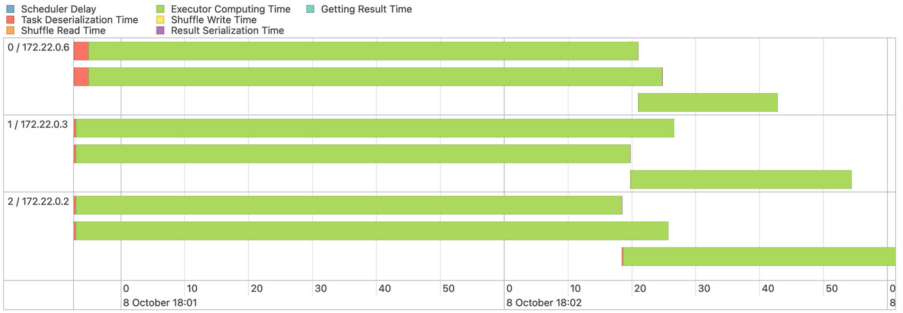
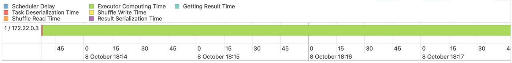
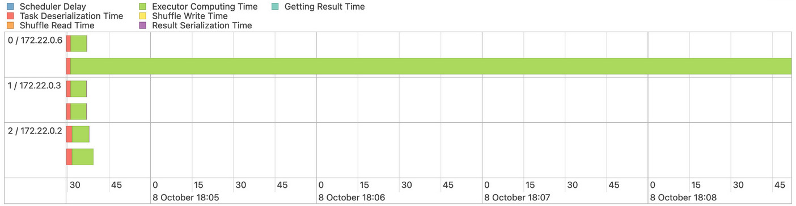
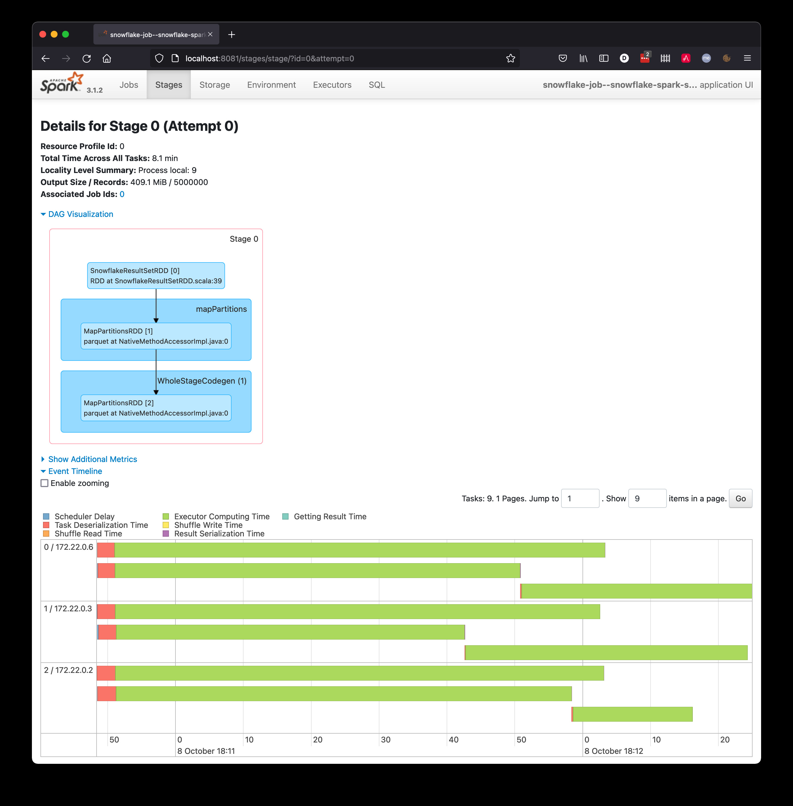
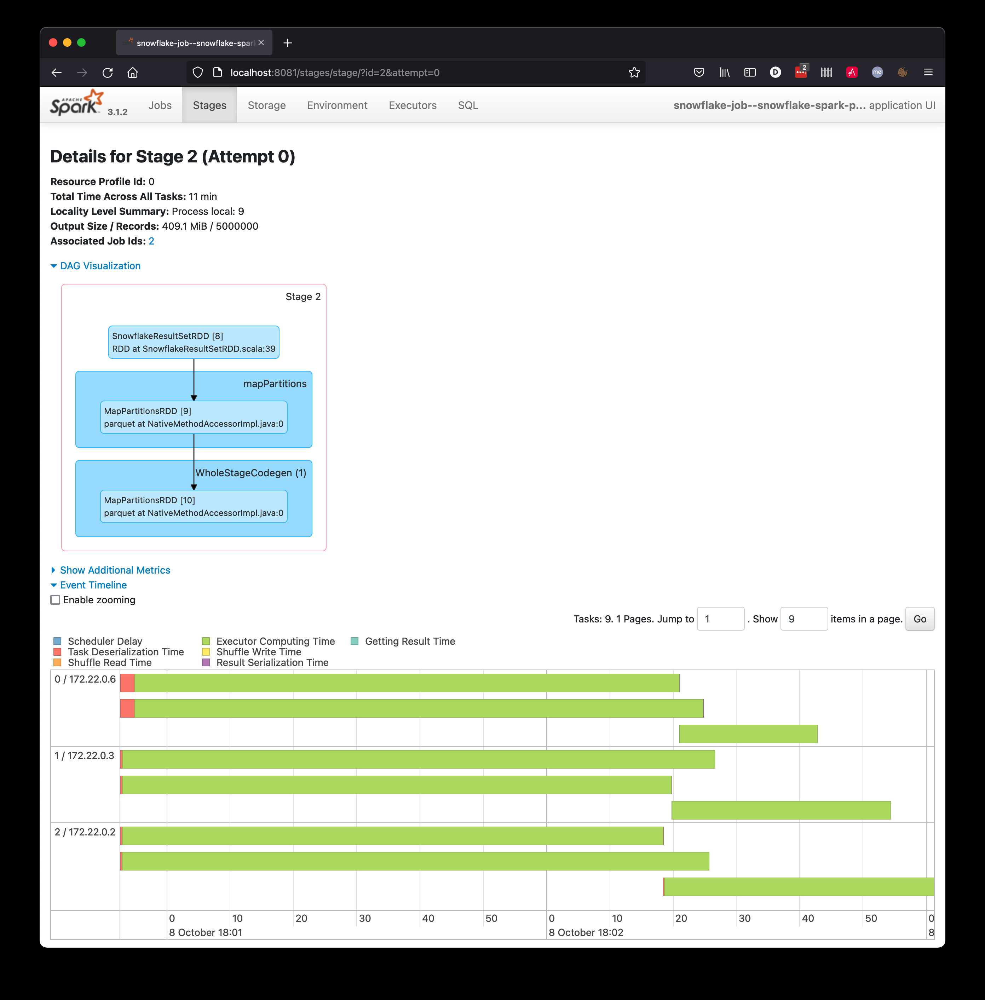
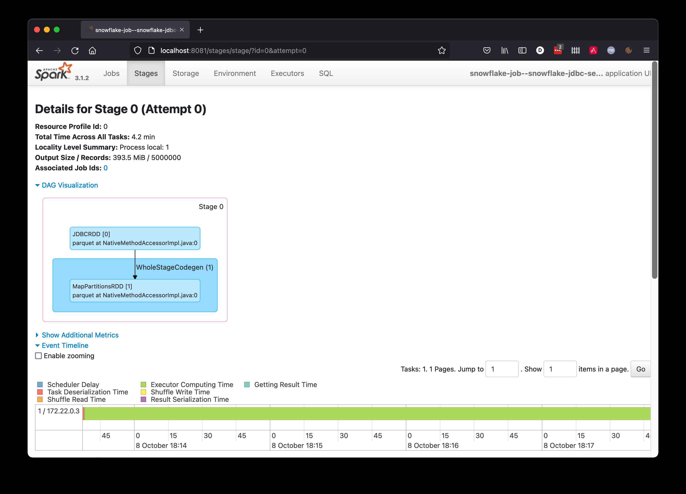
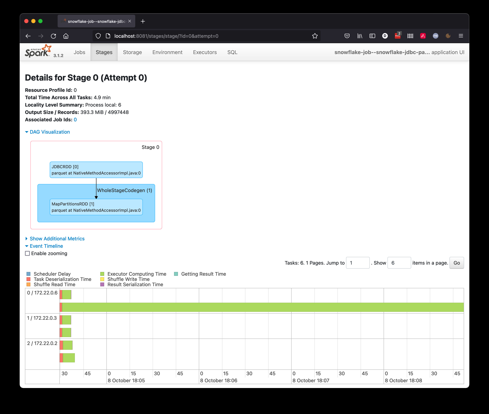

# Spark Snowflake Profiling

Just because we write a job in Spark doesn't mean it is automatically optimized to be parallelized and distributed.

The code in this benchmark repository runs 4 implementations of a Spark job submitted to a local docker-composed Spark
cluster.  Each implementation of the spark job queries data from Snowflake in different ways, providing a benchmark for
identifying the best method.

## Assessment Criteria

The best way to understand if your spark job is optimal (i.e. parallel and distributed) is to check the Spark UI of the driver node.

We want our spark jobs to look like this (parallel and distributed)



Instead of our spark jobs looking like this (non-parallel and non-distributed)



Sometimes, you may end up with a Spark job that looks like this (unevenly parallel and distributed), which is just as bad as the non-parallel and non-distributed case.




## TLDR

Using the Snowflake Spark Driver without setting any special parameters will result in a parallel data pull far
superior to the Snowflake JDBC Driver with parallelization parameters set.  This is the best method.

## Methods and Findings

### Snowflake Spark Driver - Sequential Pull

* Based on Example
  * https://docs.snowflake.com/en/user-guide/spark-connector-use.html#sample-python-script
* Results
  * SparkUI shows that the data pull occurs in parallel even though the code has no parallelization parameters set
* Assessment
  * The workload was evenly parallel and evenly distributed
  * 


### Snowflake Spark Driver - Parallel Pull

* Based on Example
  * https://docs.snowflake.com/en/user-guide/spark-connector-use.html#sample-python-script
  * While setting parallelization parameters (partitionColumn, lowerBound, upperBound, numPartitions) found here:
    * https://spark.apache.org/docs/latest/sql-data-sources-jdbc.html
* Results
  * The results were exactly the same as using the Snowflake Spark Driver to do a Sequential Pull test.
  * SparkUI shows that the data pull occurs in parallel even though the code has no parallelization parameters set
  * The snowflake drive seems to ignore the paralleization parameters provided.
* Assessment
  * The workload was evenly parallel and evenly distributed
  * 

### Snowflake JDBC Driver - Sequential Pull

* Based on Example
  * https://spark.apache.org/docs/latest/sql-data-sources-jdbc.html
  * Did not provide parallization parameters (partitionColumn, lowerBound, upperBound, numPartitions)
* Results
  * As expected, only a single Spark worker pulled from Snowflake.
  * No parallelization occured, and this was certainly the slowest method.
* Assessment
  * The workload was not parallel and not distributed
  * 

### Snowflake JDBC Driver - Parallel Pull

* Based on Example
  * https://spark.apache.org/docs/latest/sql-data-sources-jdbc.html
  * Did indeed provide parallization parameters (partitionColumn, lowerBound, upperBound, numPartitions)
* Results
  * As expected, this resulted in a parallel data pull using multiple Spark workers.
  * The tasks were spread over several workers, for example
    * Worker 1: select * from db.schema.table where key >= 0 and key < 1000000
    * Worker 2: select * from db.schema.table where key >= 1000000 and key < 2000000
    * Worker 3: select * from db.schema.table where key >= 2000000 and key < 3000000
  * Unexpected, the test showed that with this particular data pull took as long as the sequential pull for this particular dataset and query.
    * The ordinality of the index column did not allow the load to be spread evenly across partitioned pulls, especially when using the "limit" clause.
    * Thus, even though the tasks were spread over many workers, some tasks were for a small subset of data, while one
      task downloaded nearly all of the data.
* Assessment
  * The workload was unevenly parallel but was indeed distributed
  * 

## Configuring the benchmarks

* Create the file snowflake-job/snowflake_config.json

```json
{
  "username": "<snowflake_username>",
  "password": "<snowflake_password>",
  "database": "<snowflake_db>",
  "role": "<snowflake_role>",
  "schema": "<snowflake_schema>",
  "url": "<snowflake_instance>.<aws_region>.snowflakecomputing.com:443",
  "warehouse": "<snowflake_warehouse>",
  "table": "<showflake>table"
}
```

* Edit the query in Makefile


## Executing the benchmarks

```
# Start the docker cluster
make spark-start

# Run all of the pull mechanisms
make snowflake all

# While running, View the spark-client Spark UI
: http://localhost:8081

# Check out the results to see the time it took.
tail logs/*
```


## Useful Links

* AWS Glue with Snowflake Spark Driver
  * https://www.snowflake.com/blog/how-to-use-aws-glue-with-snowflake/
* Parallelize Query Optimization for regular JDBC driver
  * https://docs.databricks.com/data/data-sources/sql-databases.html#optimize-performance-when-reading-data
* The Internal Workings of Spark-Snowflake Connector
  * https://www.tigeranalytics.com/blog/internal-workings-spark-snowflake-connector/
* Parallelization via JDBC - Pyspark - How does parallelization work using JDBC?
  * https://stackoverflow.com/a/49259008/5213030